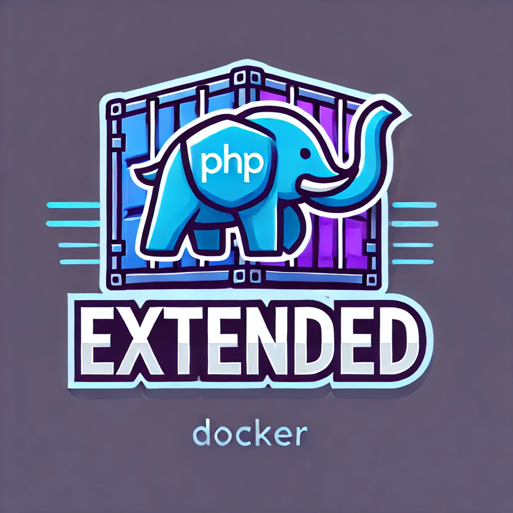

# Docker Image with PHP and Development Tools

This repository contains a Docker image with PHP and pre-installed extensions and development tools. This image is designed to provide a comprehensive development environment for PHP projects.

Complete [docker image](https://hub.docker.com/r/ipfwd/php-extended).

## Features

- PHP version: 8.4 (can be customized via build argument)
- Comprehensive set of PHP extensions (customizable via build argument)
- Essential development tools pre-installed (customizable via build argument)
- Optimized for performance and development

## Build Arguments

- `PHP_VERSION`: The version of PHP to install (default: "8.4").
- `PHP_EXTENSIONS`: A space-separated list of PHP extensions to install.
- `ADVANCED_TOOLS`: A space-separated list of additional tools and libraries to install.
- `COMPOSER_SETUP_HASH`: SHA-384 hash of the Composer setup file to verify integrity.

## Usage

To build the Docker image, use the following command:

```sh
docker build -t ipfwd/php-extended .
```

To run a container from the image, use the following command:

```shell
docker run -it --rm ipfwd/php-extended
```

# Installed PHP Extensions

The following PHP extensions are pre-installed in the Docker image:

| Extension     | Description                                                |
|---------------|------------------------------------------------------------|
| memcache      | High-performance, distributed memory object caching system |
| redis         | Extension for Redis key-value store                        |
| mongodb       | MongoDB driver                                             |
| inotify       | Inotify extension for file system event monitoring         |
| ds            | Data structures for PHP                                    |
| protobuf      | Protocol Buffers                                           |
| grpc          | gRPC extension                                             |
| imap          | IMAP library                                               |
| ast           | Abstract Syntax Tree                                       |
| xhprof        | Hierarchical Profiler                                      |
| opentelemetry | OpenTelemetry tracing                                      |
| gd            | Image processing                                           |
| gmp           | GNU Multiple Precision Arithmetic Library                  |
| pdo_pgsql     | PDO driver for PostgreSQL                                  |
| pgsql         | PostgreSQL driver                                          |
| exif          | Exchangeable image file format (Exif) reader               |
| sockets       | Sockets extension                                          |
| bcmath        | Arbitrary precision mathematics                            |
| opcache       | Zend Opcache                                               |
| zip           | ZIP archives                                               |
| pcntl         | Process Control                                            |
| intl          | Internationalization                                       |
| xsl           | XSL transformation                                         |
| xdebug        | Debugger and profiler                                      |

# Installed Development Tools

The following development tools are pre-installed in the Docker image:

| Tool               | Description                                          |
|--------------------|------------------------------------------------------|
| Composer           | Dependency Manager for PHP                           |
| Git                | Version control system                               |
| Git LFS            | Git extension for versioning large files             |
| Imagemagick        | Image processing tools                               |
| Ghostscript        | Interpreter for PostScript and PDF                   |
| PostgreSQL         | PostgreSQL client                                    |
| OpenSSH            | Secure Shell (SSH) client                            |
| MC                 | Midnight Commander file manager                      |
| jq                 | Lightweight and flexible command-line JSON processor |
| PHP_CodeSniffer    | PHP coding standards enforcement                     |
| PHP_CodeBeautifier | PHP code beautifier                                  |
| PHPDocumentor      | Documentation generator for PHP                      |
| Phan               | Static analyzer for PHP                              |
| Rector             | Instant upgrades and refactoring of PHP code         |

# Examples of Using the Image for Development

To run a PHP script located on your host machine:

```shell
docker run -it --rm -v $(pwd):/app ipfwd/php-extended php your-script.php
```

To start an interactive shell within the container for development:

```shell
docker run -it --rm -v $(pwd):/app --entrypoint=bash ipfwd/php-extended
```

To run Composer commands within the container:

```shell
docker run -it --rm -v $(pwd):/app --entrypoint=composer ipfwd/php-extended install
```

# License

This project is licensed under the MIT License. See the [LICENSE](LICENSE) file for details.
